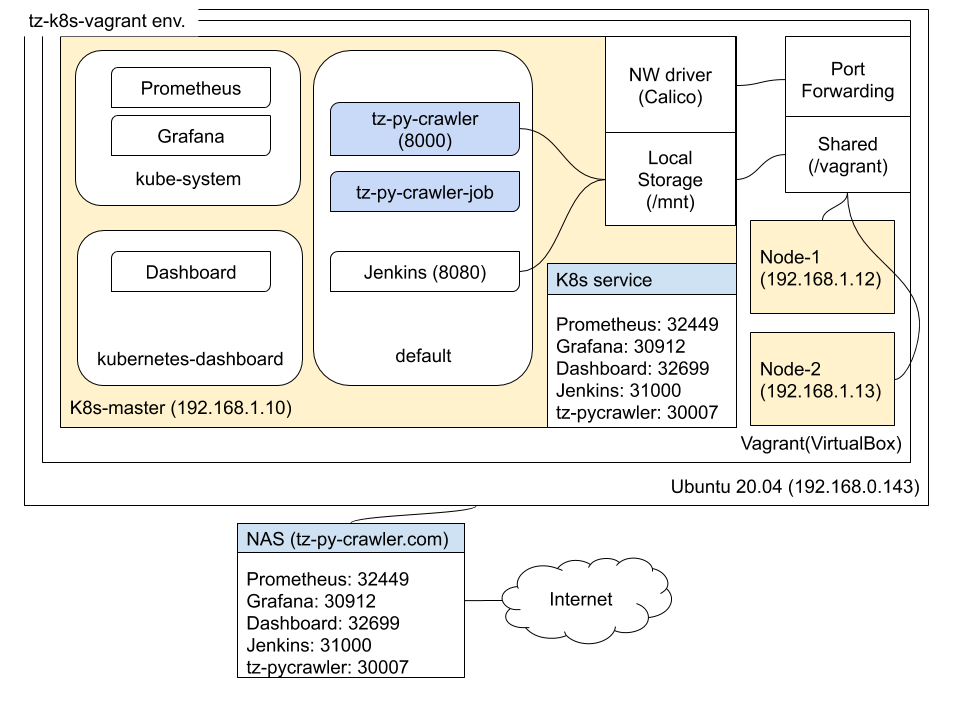
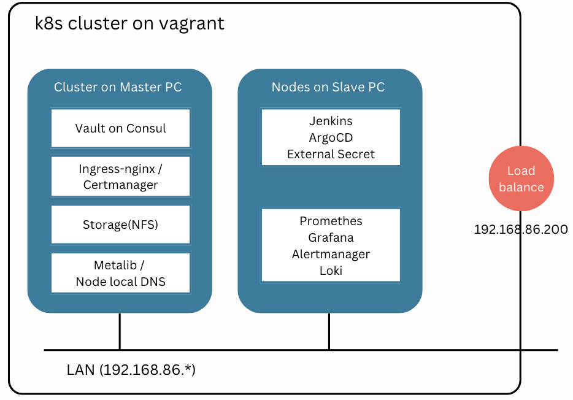

# tz-k8s-vagrant

It supports two version of k8s installation in terraform or local VMs.
to project root directory.

**Windows 사용자**: Git Bash 또는 MSYS2에서 `bash bootstrap.sh`로 실행할 수 있습니다. VirtualBox, Vagrant, Git for Windows 설치 후 사용하며, 자세한 내용은 [docs/windows-setup.md](docs/windows-setup.md)를 참조하세요.




## -. Features 
```
    -. Prep a build environment
    -. Install k8s master (kubespray.sh)
    -. Add k8s slave nodes (kubespray_add.sh)
    -. Install other applications (k8s_addtion.sh)
    -. Setup jenkins
    -. Build a demo application in jenkins
    -. Deploy the app to k8s 
```

## -. Prep a build environment
```
    -. checkout codes
       git clone https://github.com/topzone8713/tz-k8s-vagrant.git
       cd tz-k8s-vagrant

    -. Windows: Git Bash 또는 MSYS2에서 실행. docs/windows-setup.md 참조

    -. copy resources like this,
        tz-k8s-vagrant/resources
            project             # change your project name, it'll be a eks cluster name.
            config.json         # dockerhub auth

    -. project infos
    tz-k8s-vagrant/resources/project
    
    ex)
        project=topzone-k8s
        domain=topzone.me     # temporary local domain
        argocd_id=admin
        admin_password=DevOps!323
        basic_password=Soqn!323
        github_id=topzone8713       # your github_id
        github_token=               # your github token
        docker_url=index.docker.io
        dockerhub_id=topzone8713    # your dockerhub_id
        dockerhub_password=         # your dockerhub_password
        vault=xxxx                  
    
    -. dockerhub auth 
    tz-k8s-vagrant/resources/config.json
        
        {
            "auths": {
                "https://index.docker.io/v1/": {
                    "username":"topzone8713",             # your dockerhub_id
                    "password":"xxxx",                  # your dockerhub_password
                    "email":"topzone8713@gmail.com",      # your email
                    "auth":"xxxxxx"                     # base64 encoding
                }
            },
            "harbor.harbor.topzone-k8s.topzone.me": {
                "username":"admin",
                "password":"Harbor12345",
                "email":"topzone8713@gmail.com",          # your email
                "auth":"YWRtaW46SGFyYm9yMTIzNDU="
            }
        }
        
       echo -n 'topzone8713:topzone!323' | base64
        
    -. DHCP IP address check
       Each VMs are supposed to get IP from DHCP server as public_ip in your network area.
       And your master machine and other slave machines should be in the same network area.
       
       vi scripts/local/Vagrantfile
       
          config.vm.define "kube-master" do |master|
            master.vm.box = IMAGE_NAME
            master.vm.network "public_network", bridge: "en0: Wi-Fi (AirPort)", ip: "192.168.86.100"        => This should be changed to your network
            master.vm.hostname = "kube-master"
            master.vm.provision "shell", :path => File.join(File.dirname(__FILE__),"scripts/local/master.sh"), :args => master.vm.hostname
          end
        
          (1..COUNTER).each do |i|
            config.vm.define "kube-node-#{i}" do |node|
                node.vm.box = IMAGE_NAME
                node.vm.network "public_network", bridge: "en0: Wi-Fi (AirPort)", ip: "192.168.86.10#{i}"  => This should be changed to your network
                
       vi scripts/local/Vagrantfile_slave
          config.vm.define "kube-slave-1" do |slave|
            slave.vm.box = IMAGE_NAME
            slave.vm.network "public_network", xip: "192.168.86.110"        => This should be changed to your network
            slave.vm.hostname = "kube-slave"
            slave.vm.provision "shell", :path => File.join(File.dirname(__FILE__),"scripts/local/node.sh"), :args => slave.vm.hostname
          end
        
          (2..COUNTER).each do |i|
            config.vm.define "kube-slave-#{i}" do |node|
                node.vm.box = IMAGE_NAME
                node.vm.network "public_network", ip: "192.168.86.11#{i}"   => This should be changed to your network
                node.vm.hostname = "kube-slave-#{i}"
                node.vm.provision "shell", :path => File.join(File.dirname(__FILE__),"scripts/local/node.sh"), :args => node.vm.hostname
            end
          end      
          
```

## -. Install k8s master (kubespray.sh) on master machine
``` 
    -. Update IPs on inventory.ini for your master machine
        resource/kubespray/inventory.ini           

    -. Install k8s master node        
        bash bootstrap.sh M     # master machine
        # bash bootstrap.sh remove
    
    -. After installing k8s on master machine, check k8s master
        cd tz-k8s-vagrant
        vagrant status
        vagrant ssh kube-master
        sudo su
        kubectl get node
``` 

## -. Add k8s slave nodes (kubespray_add.sh)
``` 
    Copy master machine's .ssh folder to each slave machines for ssh key files
    - From: master machine
        tz-k8s-vagrant/.ssh
    - To: slave machines
        tz-k8s-vagrant/.ssh
    
    -. Update IPs on inventory.ini for your slave machine
        resource/kubespray/inventory_add.ini           

    -. Install k8s slave node        
        bash bootstrap.sh S     # slave machine
        # bash bootstrap.sh remove
    
    When slave nodes (Vagrant VMs) are up, run kubespray_add.sh on master machine.
    -. Check slave nodes' IPs
        cat tz-k8s-vagrant/info
    -. Add slave nodes' IPs on inventory_add.ini of master machine.
        tz-k8s-vagrant/resource/kubespray/inventory_add.ini
    -. Check network access on master machine.
        vagrant ssh kube-master
        sudo su
        cd /vagrant
        ansible all -i resource/kubespray/inventory_add.ini -m ping -u root    
        It should be like this,
        kube-slave-1 | SUCCESS => {
            "changed": false,
            "ping": "pong"
        }    
        ...
    -. Add k8s slave nodes on Master Node
        bash /vagrant/scripts/local/kubespray_add.sh
``` 

## -. NFS Server Setup
```
    -. NFS server is automatically installed on all VMs via scripts/local/base.sh
       - NFS server runs on kube-master (192.168.86.100)
       - Shared directory: /srv/nfs
       - Network: 192.168.86.0/24
    
    -. Kubernetes NFS integration
       - NFS provisioner is installed via master_01.sh
       - StorageClass 'nfs-client' is created for dynamic provisioning
       - Pods can use PVCs with storageClassName: nfs-client
       - PVs are automatically created on kube-master's /srv/nfs directory
```

## -. Install other applications (k8s_addtion.sh)
``` 
    -. Set temporary domains
        vagrant ssh kube-master
        sudo su
        vi /etc/hosts
        ex) 192.168.86.200 is my ingress-nginx's EXTERNAL-IP
            kubectl get svc -n default | grep ingress-nginx-controller        
        
            192.168.86.200   test.default.topzone-k8s.topzone.me consul.default.topzone-k8s.topzone.me vault.default.topzone-k8s.topzone.me
            192.168.86.200   consul-server.default.topzone-k8s.topzone.me argocd.default.topzone-k8s.topzone.me
            192.168.86.200   jenkins.default.topzone-k8s.topzone.me harbor.harbor.topzone-k8s.topzone.me
            192.168.86.200   grafana.default.topzone-k8s.topzone.me prometheus.default.topzone-k8s.topzone.me alertmanager.default.topzone-k8s.topzone.me
            192.168.86.200   vagrant-demo-app.devops-dev.topzone-k8s.topzone.me

    -. After installing k8s on all machines,
        bash /vagrant/scripts/k8s_addtion.sh
``` 

## -. Build Demo app
### cf) demo app: https://github.com/topzone8713/tz-demo-app
```
    - build a K8S in local topzone VMs
        topzone -> VMs -> k8s -> monitoring -> jenkins -> demo-app build
```

## -. Remove VMs
```
    cd tz-k8s-vagrant
    bash bootstrap.sh remove
```

## * install kubectl in macbook 
### cf) https://kubernetes.io/docs/tasks/tools/install-kubectl/
``` 
    brew install kubectl
    mkdir -p ~/.kube
    cp tz-k8s-vagrant/config ~/.kube/config
    kubectl get nodes
```

## * Access Kubernetes from host (my-ubuntu)
### Use access-k8s-from-host.sh to access k8s cluster from my-ubuntu via SSH tunnel
```
    -. Prerequisites
       - Vagrant VMs (kube-master, kube-node-1, kube-node-2) are running
       - kubectl is installed on my-ubuntu
       - You are on my-ubuntu machine
    
    -. Usage
       cd ~/workspaces/tz-k8s-vagrant
       
       # Start SSH tunnel and copy kubeconfig
       ./access-k8s-from-host.sh start
       
       # Check tunnel status
       ./access-k8s-from-host.sh status
       
       # Test connection
       ./access-k8s-from-host.sh test
       
       # Stop tunnel
       ./access-k8s-from-host.sh stop
       
       # Restart tunnel
       ./access-k8s-from-host.sh restart
    
    -. What it does
       - Creates SSH tunnel: my-ubuntu -> kube-master (127.0.0.1:6443)
       - Copies kubeconfig from kube-master to ~/.kube/config
       - Updates kubeconfig server address to use localhost:6443
       - Allows kubectl commands from my-ubuntu
```

## * Access Kubernetes from MacBook (or local PC)
### Use access-k8s-from-mypc.sh to access k8s cluster from MacBook via my-ubuntu
```
    -. Prerequisites
       - my-ubuntu has access-k8s-from-host.sh script
       - SSH access to my-ubuntu is configured (ssh my-ubuntu works)
       - kubectl is installed on MacBook (brew install kubectl)
       - You are on MacBook or local PC
    
    -. Usage
       cd ~/workspaces/tz-k8s-vagrant  # or project directory
       
       # Start double SSH tunnel and copy kubeconfig
       ./access-k8s-from-mypc.sh start
       
       # Check tunnel status
       ./access-k8s-from-mypc.sh status
       
       # Test connection
       ./access-k8s-from-mypc.sh test
       
       # Stop tunnel
       ./access-k8s-from-mypc.sh stop
       
       # Restart tunnel
       ./access-k8s-from-mypc.sh restart
    
    -. What it does
       - Creates double SSH tunnel: MacBook -> my-ubuntu -> kube-master
       - Copies kubeconfig from my-ubuntu to ~/.kube/my-ubuntu.config
       - Updates kubeconfig server address to use localhost:6443
       - Sets KUBECONFIG environment variable
       - Allows kubectl commands from MacBook
    
    -. Using kubectl
       # Set KUBECONFIG environment variable
       export KUBECONFIG="$HOME/.kube/my-ubuntu.config"
       
       # Use kubectl commands
       kubectl get nodes
       kubectl get pods --all-namespaces
       kubectl cluster-info
    
    -. Network Architecture
       MacBook (localhost:6443) 
         -> SSH Tunnel 
         -> my-ubuntu (127.0.0.1:6443) 
         -> SSH Tunnel 
         -> kube-master (127.0.0.1:6443)
```

## * Access Kubernetes Ingress from MacBook (or local PC)
### Use access-ingress-from-mypc.sh to access Kubernetes services/ingresses via kubectl port-forward
```
    -. Prerequisites
       - access-k8s-from-mypc.sh must be run first (kubectl access must be configured)
       - kubectl is installed on MacBook (brew install kubectl)
       - You are on MacBook or local PC
    
    -. Usage
       cd ~/workspaces/tz-k8s-vagrant  # or project directory
       
       # List available services and ingresses
       bash access-ingress-from-mypc.sh list
       bash access-ingress-from-mypc.sh list kube-system  # List in specific namespace
       
       # Start port-forward for default service (ingress-nginx-controller)
       bash access-ingress-from-mypc.sh start
       
       # Start port-forward for specific service
       bash access-ingress-from-mypc.sh start my-service
       bash access-ingress-from-mypc.sh start my-service production  # With namespace
       
       # Check port-forward status
       bash access-ingress-from-mypc.sh status
       
       # Stop port-forward
       bash access-ingress-from-mypc.sh stop my-service production
       
       # Restart port-forward
       bash access-ingress-from-mypc.sh restart my-service production
       
       # Show help
       bash access-ingress-from-mypc.sh help
    
    -. What it does
       - Uses kubectl port-forward to forward service ports to localhost
       - Default: forwards ingress-nginx-controller service (HTTP:8080, HTTPS:8443)
       - **Important**: Forwarding ingress-nginx-controller allows access to ALL ingresses
       - All ingress domains can be accessed through the same port (8080/8443)
       - Automatically detects service ports (HTTP/HTTPS)
    
    -. Important Notes
       - Only one port-forward is needed: ingress-nginx-controller
       - Once ingress-nginx-controller is forwarded, all ingress domains are accessible
       - Individual service port-forwarding is not necessary (and may cause conflicts)
       - Just add desired domains to /etc/hosts and access them via the forwarded port
    
    -. Example: Access Ingress
       # 1. Start port-forward for ingress-nginx-controller (default, accesses all ingresses)
       bash access-ingress-from-mypc.sh start
       # or explicitly:
       bash access-ingress-from-mypc.sh start ingress-nginx-controller default
       
       # 2. Add domains to /etc/hosts (add all domains you want to access)
       sudo sh -c 'echo "127.0.0.1  jenkins.default.topzone-k8s.topzone.me" >> /etc/hosts'
       sudo sh -c 'echo "127.0.0.1  test.default.topzone-k8s.topzone.me" >> /etc/hosts'
       
       # 3. Access in browser (all ingresses accessible via same port)
       http://jenkins.default.topzone-k8s.topzone.me:8080
       http://test.default.topzone-k8s.topzone.me:8080
       https://jenkins.default.topzone-k8s.topzone.me:8443
```


